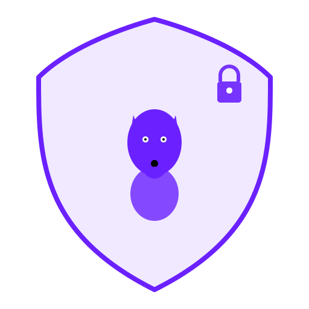

<div align="center">



# WolfGuard Website

Official website for **WolfGuard** - an open-source VPN server with TLS 1.3/DTLS 1.3 support and Cisco Secure Client compatibility.

[Website](https://wolfguard.io) • [Documentation](https://docs.wolfguard.io) • [GitHub](https://github.com/dantte-lp/wolfguard-site)

---

[](https://github.com/dantte-lp/wolfguard-site/actions/workflows/ci.yml)
[](https://github.com/dantte-lp/wolfguard-site/actions/workflows/cd.yml)
[](https://github.com/dantte-lp/wolfguard-site/releases)
[](./LICENSE)

[](https://nextjs.org/)
[](https://react.dev/)
[](https://www.typescriptlang.org/)

</div>

## Tech Stack

- **Next.js** 15.x (React Framework with App Router)
- **React** 19.2.0
- **TypeScript** 5.7.3
- **Tailwind CSS** 4.1.16
- **HeroUI** 2.8.5 (NextUI successor)
- **Framer Motion** 12.10.0
- **Node.js** 24.x LTS

## Prerequisites

- **Docker** or **Podman** installed
- **Git** for version control
- No need to install Node.js locally - everything runs in containers!

## Quick Start (Development)

### Option 1: Using Makefile (Recommended)

```bash
# Clone the repository
git clone https://github.com/dantte-lp/wolfguard-site.git
cd wolfguard-site

# Start development server
make dev

# The site will be available at http://localhost:3000
```

### Option 2: Using Podman Compose Directly

```bash
# Clone the repository
git clone https://github.com/dantte-lp/wolfguard-site.git
cd wolfguard-site

# Start development server
podman-compose -f docker-compose.dev.yaml up

# The site will be available at http://localhost:3000
```

### Option 3: Manual Development (requires Node.js 24.x LTS)

```bash
# Install dependencies
npm install

# Start development server
npm run dev
```

## Available Commands

### Development Commands

```bash
make dev              # Start development server
make dev-down         # Stop development containers
make dev-logs         # Show development logs
make dev-shell        # Open shell in development container
make dev-restart      # Restart development server
```

### Build Commands

```bash
make build            # Build production container
make build-dev        # Build development container
make build-no-cache   # Build without cache
```

### Testing & Quality Commands

```bash
make test             # Run tests
make lint             # Run ESLint
make lint-fix         # Run ESLint with auto-fix
make type-check       # Run TypeScript type checking
make format           # Format code with Prettier
make format-check     # Check code formatting
make check-all        # Run all checks (lint, type-check, format)
```

### Deployment Commands

```bash
make deploy           # Deploy production containers
make deploy-down      # Stop production containers
make deploy-logs      # Show production logs
make deploy-restart   # Restart production
make deploy-build     # Build and deploy
```

### Utility Commands

```bash
make clean            # Clean containers, volumes, artifacts
make clean-all        # Deep clean including node_modules
make prune            # Prune unused Podman resources
make ps               # Show running containers
make images           # Show project images
make info             # Show project information
make health           # Check container health
make stats            # Show resource usage
make help             # Show all available commands
```

## Project Structure

```
wolfguard-site/
├── app/                         # Next.js App Router pages
├── components/                  # React components
├── deploy/                      # Deployment configuration
│   └── config/                  # Container & compose configs
│       ├── Containerfile        # Production container
│       ├── Containerfile.dev    # Development container
│       ├── compose.yaml         # Production compose config
│       ├── compose.prod.yaml    # Production with Traefik
│       └── nginx.conf           # Nginx configuration
├── docs/                        # Documentation
│   └── TECHNICAL_SPECIFICATIONS_FOR_WEBSITE_DEVELOPMENT.md
├── public/                      # Static assets
├── docker-compose.dev.yaml      # Development compose config
├── Makefile                     # Build & deployment automation
├── next.config.ts               # Next.js configuration
├── package.json                 # Dependencies
├── tailwind.config.ts           # Tailwind CSS config
├── tsconfig.json                # TypeScript config
└── README.md                    # This file
```

## Development Workflow

### 1. Start Development Environment

```bash
# Using Makefile (recommended)
make dev

# Or using podman-compose directly
podman-compose -f docker-compose.dev.yaml up
```

### 2. Create a Feature Branch

```bash
git checkout -b feature/your-feature-name
```

### 3. Make Changes

Edit files in the `app/` or `components/` directories. The development server will automatically reload.

### 4. Run Quality Checks

```bash
# Run all checks
make check-all

# Or run individually
make lint
make type-check
make format
```

### 5. Commit Changes

```bash
git add .
git commit -m "feat: your feature description"
```

### 6. Push and Create PR

```bash
git push origin feature/your-feature-name
# Create Pull Request on GitHub
```

## Building for Production

### Build Production Image

```bash
# Using Makefile (recommended)
make build

# Or using Buildah directly
buildah bud -f deploy/config/Containerfile -t localhost/wolfguard-site:latest .
```

### Run Production Container

```bash
# Using Podman directly
podman run -d -p 8080:8080 localhost/wolfguard-site:latest
```

### Deploy with Podman Compose

```bash
# Using Makefile (recommended)
make deploy

# Or using podman-compose directly
podman-compose -f deploy/config/compose.yaml up -d

# With Traefik integration
make deploy-traefik
# Or
podman-compose -f deploy/config/compose.prod.yaml up -d
```

## Environment Variables

Create a `.env` file in the root directory:

```env
NODE_ENV=development
VITE_HOST=0.0.0.0
VITE_PORT=5173
```

## Troubleshooting

### Container won't start

```bash
# Check if port 3000 is already in use
lsof -i :3000

# Stop and remove containers
make dev-down

# Rebuild and start containers
make dev-build
```

### Hot reload not working

Make sure you're using the correct volume mounts in `docker-compose.dev.yaml`:

```yaml
volumes:
  - .:/app:rw
  - /app/node_modules
```

### Permission issues

```bash
# Fix permissions (inside container)
make dev-shell
# Then inside the container:
chown -R node:node /app
```

### Clean up everything

```bash
# Remove containers, volumes, and build artifacts
make clean

# Deep clean including node_modules
make clean-all

# Prune unused Podman resources
make prune
```

## Development Status

<div align="center">

### Code Quality & Tools

[](https://eslint.org/)
[](https://prettier.io/)
[](./tsconfig.json)

### Technology Stack Details

[](https://tailwindcss.com/)
[](https://nodejs.org/)

### Container & Deployment

[](https://www.docker.com/)
[](https://podman.io/)
[](https://github.com/dantte-lp/wolfguard-site/pkgs/container/wolfguard-site)

### Project Stats

[](https://github.com/dantte-lp/wolfguard-site/stargazers)
[](https://github.com/dantte-lp/wolfguard-site/network/members)
[](https://github.com/dantte-lp/wolfguard-site/issues)
[](https://github.com/dantte-lp/wolfguard-site/pulls)
[](https://github.com/dantte-lp/wolfguard-site/graphs/contributors)

</div>

## Scrum Plan & GitHub Issues

- View the full Scrum plan: [SCRUM_PLAN.md](./SCRUM_PLAN.md)
- Track progress: [GitHub Issues](https://github.com/dantte-lp/wolfguard-site/issues)
- All 39 User Stories are created and labeled by sprint

## Documentation

### For Users

- **Quick Start**: See above for getting started
- **User Guide**: [docs/users/](./docs/users/)

### For Developers

- **Development Guide**: [docs/developers/DEVELOPMENT.md](./docs/developers/DEVELOPMENT.md)
- **Contributing**: [CONTRIBUTING.md](./CONTRIBUTING.md)
- **Technical Specifications**: [docs/TECHNICAL_SPECIFICATIONS_FOR_WEBSITE_DEVELOPMENT.md](./docs/TECHNICAL_SPECIFICATIONS_FOR_WEBSITE_DEVELOPMENT.md)

### For DevOps

- **Deployment Guide**: [docs/devops/DEPLOYMENT.md](./docs/devops/DEPLOYMENT.md)
- **Infrastructure Guide**: [docs/devops/INFRASTRUCTURE.md](./docs/devops/INFRASTRUCTURE.md)
- **Ansible Playbooks**: [deploy/ansible/](./deploy/ansible/)

### Other Resources

- **Dependencies**: [DEPENDENCIES_VERSIONS.md](./DEPENDENCIES_VERSIONS.md)
- **Scrum Plan**: [SCRUM_PLAN.md](./SCRUM_PLAN.md)
- **Security Policy**: [SECURITY.md](./SECURITY.md)

## Contributing

We welcome contributions! Please see our [Contributing Guide](./CONTRIBUTING.md) for details.

### Quick Contributing Guide

1. Fork the repository
2. Create a feature branch (`git checkout -b feature/amazing-feature`)
3. Make your changes
4. Run tests and checks (`make check-all`)
5. Commit your changes (`git commit -m 'feat: add amazing feature'`)
6. Push to the branch (`git push origin feature/amazing-feature`)
7. Open a Pull Request

See [CONTRIBUTING.md](./CONTRIBUTING.md) for detailed guidelines.

## Security

Found a security vulnerability? Please see our [Security Policy](./SECURITY.md) for reporting instructions.

## License

This project is licensed under the GNU General Public License v3.0 - see the [LICENSE](./LICENSE) file for details.

## Links

- **Website**: [wolfguard.io](https://wolfguard.io)
- **Documentation**: [docs.wolfguard.io](https://docs.wolfguard.io)
- **GitHub**: [github.com/dantte-lp/wolfguard-site](https://github.com/dantte-lp/wolfguard-site)

---

Built with React, TypeScript, and Tailwind CSS by the WolfGuard Team
